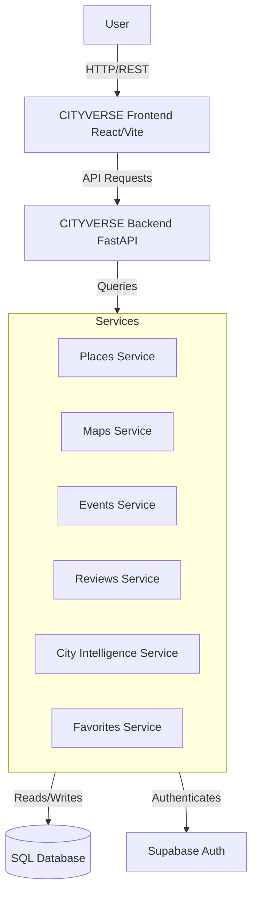

<div align="center">

# 🌆 CITYVERSE

**Your City. Your Way.**

CITYVERSE is a powerful city discovery and urban intelligence platform that helps users discover places, explore neighborhoods, plan routes, find events, create collections, and understand their city through intelligent data and interactive visualizations.

[](https://reactjs.org/)
[](https://www.typescriptlang.org/)
[](https://fastapi.tiangolo.com/)
[](https://tailwindcss.com/)

</div>

---

## 📸 Project Preview

> 📸 Screenshots coming soon.

---

## 🌆 About CITYVERSE

CITYVERSE is designed to bring city exploration, discovery, planning, and urban intelligence into one unified platform. 

People often need multiple applications to discover places, understand neighborhoods, plan routes, find events, explore cities, and analyze city information. CITYVERSE brings these experiences together in an intuitive, beautifully designed application that scales to any city.

---

## ✨ Key Features

### 🗺️ City Exploration
- **Explore Cities:** Dynamic map views centered around your points of interest.
- **Discover Places:** Find the most interesting spots near you.
- **Interactive Map:** Powered by Leaflet to provide a seamless mapping experience.
- **Search Locations:** Quickly search for locations by name, category, or mood.

### 📍 Places & Destinations
- **Categories & Filters:** Filter places by Cafe, Bar, Park, Museum, Restaurant, etc.
- **Place Details:** Get rich information including images, descriptions, opening hours, contact details, and amenities.
- **Get Directions:** Uses geolocation to open Google Maps with precise route directions from your current location.

### 🧭 Route Planning
- **Create Routes:** Add locations to a route planner to optimize your trip.
- **Route Visualization:** Preview routes directly on the interactive map with dynamic re-centering.

### 🎉 Events
- **Discover Events:** Browse upcoming local events.
- **Event Exploration:** Filter and view details for live events happening in the city.

### 📚 Collections
- **Create Collections:** Bookmark your favorite locations.
- **Save Places:** One-click save to build your personal library of spots to visit.

### ⭐ Reviews
- **User Reviews & Ratings:** Share experiences and rate locations.
- **Review Breakdown:** See aggregated reviews and comments from the community.

### 📊 City Intelligence
- **Weather Insights:** Real-time temperature, condition, humidity, and UV index.
- **Air Quality (AQI):** PM2.5, PM10, and overall air quality index.
- **Traffic Data:** Current congestion levels and status.
- **Crime & Safety:** Safety scores and localized crime risk assessments.
- **City Demographics:** Population metrics, density, and general health scores.

---

## 💡 Why CITYVERSE?

- 🌍 **One Platform:** Combines exploration, routing, events, and data in a single app.
- 🗺️ **Interactive Discovery:** Map-driven interfaces make finding places visual and intuitive.
- 🧭 **Personalized Planning:** Plan routes and save favorite locations for future trips.
- 🎯 **Mood & Interest Based:** Discover places based on your current vibe (e.g., Adventure, Relaxing).
- 📊 **Data-Driven:** Deep urban intelligence helps you understand the safety, weather, and traffic of the area.

---

## 🛠️ Tech Stack

| Category | Technology |
|---|---|
| **Frontend** | React 19, TypeScript, Vite, Tailwind CSS, Framer Motion, Lucide React, Zustand |
| **Backend** | Python, FastAPI, Uvicorn, SQLAlchemy, Pydantic |
| **Database** | SQLite (Development), PostgreSQL ready (via psycopg2) |
| **Maps** | Leaflet, React-Leaflet |
| **Authentication** | Supabase Auth (@supabase/supabase-js) |

---

## 🏗️ Architecture



---

## 🔄 How CITYVERSE Works

1. **User Authentication:** User logs in securely via Supabase.
2. **City Selection & Search:** User selects or searches for a city/mood.
3. **Exploration:** CITYVERSE loads dynamic places and neighborhoods onto a responsive grid and interactive map.
4. **Interaction:** User can view specific place details, read reviews, and check amenities.
5. **Planning:** User can add locations to the Route Planner or click "Get Directions" for live navigation.
6. **Collections:** User clicks the heart icon to save places to their personal "Saved" collection.
7. **Intelligence:** User accesses the City Intelligence dashboard to view weather, AQI, safety, and traffic data.

---

## 📁 Project Structure

```text
CITYVERSE/
├── backend/                  # FastAPI Backend
│   ├── app/
│   │   ├── api/              # API Route Handlers
│   │   ├── core/             # Core Services & DB Config
│   │   ├── main.py           # Application Entry Point
│   │   ├── models.py         # SQLAlchemy Models
│   │   └── schemas.py        # Pydantic Schemas
│   ├── seed.py               # Database Seeding Script
│   └── .env                  # Backend Environment Variables
├── frontend/                 # React Frontend
│   ├── src/
│   │   ├── components/       # Reusable UI, Map, Auth Components
│   │   ├── lib/              # Utilities and Static Data
│   │   ├── pages/            # Page Views (Explore, PlaceDetails, Saved, etc.)
│   │   ├── App.tsx           # Main React Router
│   │   └── index.css         # Tailwind Directives
│   ├── index.html            # Vite HTML Template
│   ├── package.json          # Frontend Dependencies
│   ├── tailwind.config.js    # Tailwind Configuration
│   └── vite.config.ts        # Vite Configuration
└── README.md                 # Project Documentation
```

---

## 🚀 Getting Started

### Prerequisites
- Node.js (v18+)
- Python 3.10+
- A Supabase account (for authentication)

### 1. Start the Backend

Open a terminal and navigate to the backend directory:

```bash
cd backend

# Create and activate a virtual environment
python -m venv venv
# Windows:
.\venv\Scripts\activate
# Mac/Linux:
source venv/bin/activate

# Install dependencies (if you have a requirements.txt)
pip install -r requirements.txt

# Run the database seeder to populate places
python seed.py

# Start the FastAPI server
uvicorn app.main:app --reload
```
*The backend API will be available at `http://localhost:8000`.*

### 2. Start the Frontend

Open a **new** terminal and navigate to the frontend directory:

```bash
cd frontend

# Install dependencies
npm install

# Start the Vite development server
npm run dev
```
*The frontend will be available at `http://localhost:5173`.*

---

## 🔮 Future Enhancements

- 📱 Mobile App (React Native)
- 🤖 AI-driven personalized route generation
- 🌍 Live community event hosting
- 🎫 In-app ticket booking for events

---

**Built with ❤️ for city explorers.**
